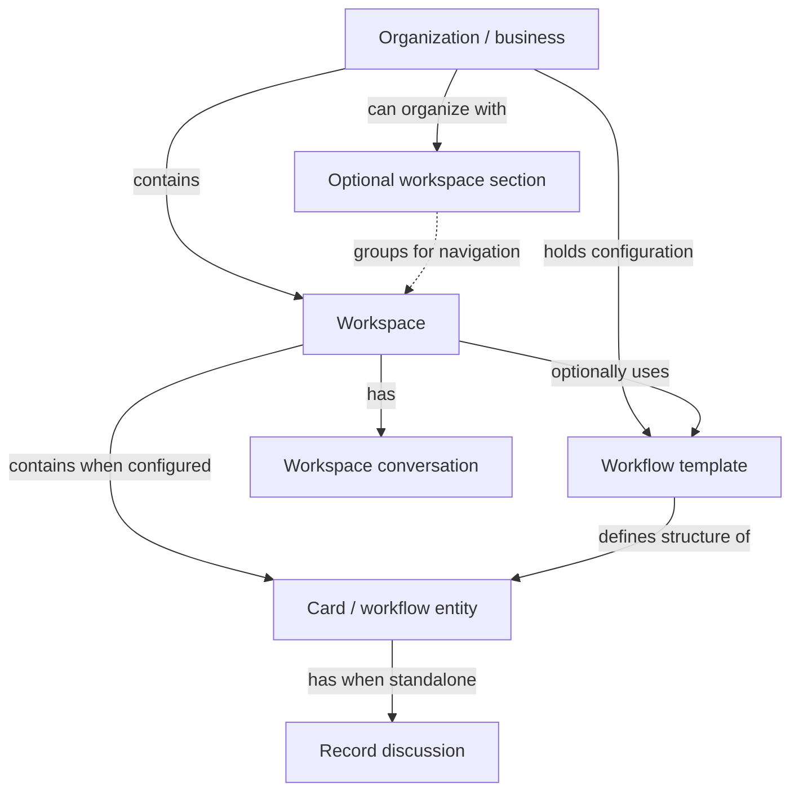

# Coast Product Model

This reference maps Coast's organization, workspaces, people, conversations, navigation, and reusable workspace installations. For the shape of records, see [Workflow Building Blocks](workflow-building-blocks.md); for presentation, see [Views, Forms, And Dashboards](views-forms-and-dashboards.md).

## Coast At A Glance

Coast is a no-code platform where maintenance-heavy and operational teams communicate and manage structured work in configurable workspaces. Its product center is deskless operations and CMMS-style work: maintenance teams, work orders, preventive maintenance, assets, locations, parts, vendors, requests, inspections, and operational reporting. Other workflows can be modeled with the same building blocks.

A workspace can sit outside a named section. Its workflow-template association is optional; the section does not own its records or template. A workflow template defines a record's structure. View templates configure how existing records appear in collections and how people view, edit, or submit forms; selecting one does not create an independent view or copy of the records.

## Organizations, Workspaces, And Sections

### Organization Boundary

An organization is the top-level customer/account boundary. Internal APIs and MCP resources often call it a business. Access, users, workspaces, and data are scoped to an organization/business. A person can belong to multiple organizations/businesses, but a given workflow or workspace belongs to one context.

### Workspaces

Workspaces combine communication and structured work. Every workspace has a chat thread and members. A workflow workspace is also backed by a workflow template and contains cards/workflow entities; a communication workspace can be used for team conversation without structured records. A workflow workspace can offer several saved views over the same records.

### Workspace Navigation

Optional workspace sections group workspaces for navigation, such as Operations, Maintenance, Sales, Support, HR, or Locations. They are not workflows and do not own the workspaces' data. A person's favorite workspace is a separate client-local shortcut, not section membership or a workspace access grant. An organization bookmark is a named URL, not a workspace or saved view.

## People And Access

Users are people in an organization/business. Workspaces have members; membership and role settings help determine what a person can see or do. User groups help manage sets of people and can be associated with workspace access. A Person field on a card names a user for a purpose such as assignment, but does not itself grant workspace access.

Common access levels include read-only viewing, editing or contributing, full administrative control, and personal record access within a workflow workspace. Organization roles and workspace record/configuration access answer different questions. Personal record access limits which records a member can see based on references to them in Person fields; it is unrelated to a private direct conversation.

**Presentation is not authorization.** A view can hide a field, make it read-only, filter a collection, or simplify a form for a role. These choices shape the experience, but do not replace the applicable organization and workspace access controls. A picker filter narrows choices, not access to the underlying records. Check access for the person and action instead of inferring it from assignment, view visibility, or a filtered list.

## Conversations And Activity

Workspace chat is for general discussion in a workspace. Standalone cards/workflow entities have their own discussion threads, keeping diagnosis, updates, files, and decisions attached to the exact work item. For example, Work Orders can have a general team thread while each work order has its own discussion. Embedded subform data stays inside its parent card; it is not an independently created child card with its own thread.

The activity feed shows recent activity across Coast: what changed, who acted, and where attention may be needed. It complements workspace chat and record threads with a broader chronological view. A filtered collection or dashboard can focus attention on assigned, overdue, blocked, or upcoming work; the feed is a different surface for recent activity.

## Reusing Workspace Configuration

Workflow bundles package a workflow workspace or a section of workspaces with their configuration, including templates, views, and automations, for reuse elsewhere. Coast curates the library's bundle listings. Customers can also share a workflow workspace or a section through an install link without publishing it to the library or entering an approval process.

Installing a bundle or creating a workflow workspace produces active, customizable workspaces and workflow template copies. Source/library templates and active workspace templates have different identities; [template copies](workflow-building-blocks.md#template-sources-and-installed-copies) explains why that matters for record values, views, automations, and later edits. Bundles are starting points, not locked products.

## Working Mental Model

- Workspaces are places where people communicate and work.
- Workflow templates define the shape of records; cards/entities are the records themselves.
- Components define fields and interactive pieces. Relationships connect records.
- View templates configure collections and forms over the same records; dashboard widgets summarize or link to saved collection views.
- Automations explicitly act on records, while recurring schedules generate separate occurrences.
- Bundles install customizable workspace configurations.
