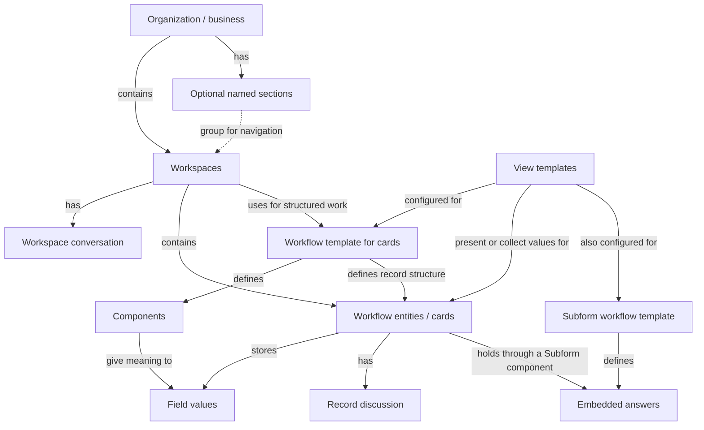

# The shape of Coast

Coast is a no-code CMMS and work-management product for maintenance-heavy, deskless, and operational teams. It combines structured work and team communication in configurable workspaces. An organization can use the same building blocks to manage work orders, assets, locations, inspections, parts, or other operational work. Those business names come from the organization's configuration; they do not each require a separate built-in application.

## The organization and its workspaces

An **organization**, also called a **business** in APIs, is the customer context for people, workspaces, configuration, and subscription. A person's account is distinct from their membership in an organization. Organization roles and workspace grants determine what that person can access or change.

### Sections organize workspaces

An organization has workspaces, which can be grouped into named **workspace sections**. A Maintenance section might bring together Work Orders, Assets, and Parts. Sections organize navigation; the workspaces retain their own records, conversations, and access. A workspace can also appear outside a named section.

### Workspaces combine work and conversation

A **workspace** is a place for a team to discuss and manage work. It has a conversation context and can carry structured work through an associated workflow definition. Its views let people work with its records in different ways. A chat-focused entry experience and a workflow-focused entry experience emphasize different parts of that workspace.

For example, a Work Orders workspace can contain the team's general maintenance discussion and individual work-order records. Each work order has its own discussion thread, keeping diagnosis, updates, and decisions attached to that job. Direct conversations provide another context for talking with people outside a particular work record.

These contexts share message concepts such as text, attachments, mentions, and reactions. Workspace discussion and a card's comments are distinct threads even when the same people participate. See [People](organization/people.md), [Access](organization/access.md), [Workspaces](organization/workspaces.md), and [Conversations](organization/conversations.md) for the identities and grants behind them.

## How structured work is defined and used

Three concepts separate the structure of work, its actual data, and its presentation:

| Concept | What it does | Work-order example |
| --- | --- | --- |
| **Workflow template** | Defines a data structure through components and associated configuration, for standalone records or embedded subform answers. | Defines the fields for work orders, or the questions in an embedded inspection. |
| **Workflow entity**, usually called a **card** | Holds one record's values in a workspace, with its identity, history, and discussion. | A request to repair a pump, with its own assignee, status, and comments. |
| **View template** | Configures how records or embedded subform answers are presented and entered. | A technician's work list, a creation form, or an embedded inspection form. |

The word *template* has different roles here. A workflow entity is an instance of a workflow template used for standalone records. A subform workflow template instead defines answers embedded in a parent record. A view template configures the rendered experience in either context; it does not produce a separate persistent “view instance.”

The diagram names product relationships rather than database ownership. A workspace's workflow association is optional, and template definitions belong to the organization's configuration. The subform branch ends in parent-owned answers rather than independent cards. Direct conversations have their own context outside the record branch.

### Components define what a record can contain

A **component** defines a field or interactive part of a workflow. Text, Number, Date, Tag, Person, and File fields collect different kinds of values. Other components connect records, derive information, present instructions, or control an interaction. Their configuration gives those capabilities meaning in the customer's process.

A Tag field named Status can define the customer's work-order states. A Person field can hold the assignee. A Timer can record time spent on the job. The same component types support different processes through their names and configuration.

Component definitions and record values are distinct. Changing a field's label changes configuration; changing a work order's assigned person changes record data. A view can control whether the field appears, is required, or can be edited in a particular experience. See [Components](workflows/components.md) for functional discovery, shared settings, and the full catalogue.

### Relationships connect work across workspaces

Work Orders can refer to records in Assets; Assets can refer to Locations. These connections make the organization a network of related records rather than a set of isolated lists.

Three components express different sides of that network:

- **Related Card** stores a forward link, such as a work order's asset.
- **Referenced In** presents reverse links, such as the work orders that reference an asset.
- **Lookup** reads a field through a relationship, such as an asset value displayed on a work order.

Together, these components let people follow work from one record to another and see related information in context. See the [connected-record explanation](workflows/components.md#connected-records-and-derived-values) for their configuration and value semantics.

### Subforms collect embedded answers

A **Subform** component allows structured answers within a parent record, such as a procedure completed during a work order. Allowed subform definitions specify the available questions; view templates configure their create and update forms. Answer types can include supporting notes and files.

These answers belong to the parent record. They do not acquire an independent workflow entity identity or comment thread. Their configuration, values, and presentation are connected through the [Subform entry](workflows/components.md#subform).

### View templates adapt the same records to different experiences

**Collection view templates** present sets of records. List, Table, Board, Calendar, and Tree are collection presentations with different configuration and field dependencies. A calendar uses a date field; a board groups records; a tree uses parent relationships. Changing a presentation does not create another copy of the records.

Collection criteria describe which records appear, how they are grouped, and how they are sorted. Several collection views can present different selections of the same workflow’s records.

**Card view templates** configure a single record's display and forms. A create form can show different fields or requirements from the form used to update an existing record. Subform create/update forms use the same presentation concept for their embedded answers. Public forms and shared cards add an access/link context to these experiences.

See [View templates](workflows/view-templates.md) for collection configuration, forms, and the other experiences that use these definitions.

### Automations and recurrence govern behavior

An **automation** connects a trigger to actions, such as changing record values or sending a notification, with optional conditions that restrict when they run.

**Recurring work** generates repeated records from a configured schedule. The schedule, the series, and each occurrence have different scopes: changing one occurrence is a different operation from changing the series. See [Automations](workflows/automations.md) for rules and [Recurring work](workflows/recurrence.md) for schedules and series behavior.

## Working across the organization

### Finding and returning to work

Navigation organizes workspaces into sections and provides shortcuts such as favorites and bookmarks. These help people return to the places they use.

Search helps people find workspaces and people, cards, and messages, including comments attached to cards. Results retain their context so a person can return to the relevant workspace or record. Global search, searching within a collection, and searching a relationship picker have different scopes; one should not be used as a promise about another's results. See [Search and navigation](across-workspaces/search-and-navigation.md).

### Following activity

Read state, notifications, the mentions feed, and activity help a person decide what needs attention. They are related but separate: a notification is an alert, a mention is part of a message, and a record's history records changes to that record. [Attention and activity](across-workspaces/attention-and-activity.md) connects these surfaces to their originating objects.

### Summarizing work

A **dashboard** combines widgets for operational summaries. Its widgets reuse collection views, so the configured record population remains connected to the list of work a person can open.

A **report** presents an analysis with its own population, metric, and time window. Dashboards provide operational summaries connected to collections; reports support analysis of the work. See [Dashboards](across-workspaces/dashboards.md) and [Reports](across-workspaces/reports.md).

### Reusing configuration and exchanging data

Coast's curated workflow library supplies reusable starting points, including bundles of workflows. Customer workflow sharing lets an organization distribute its own configuration, optionally including card data, through installation links. Installing creates independently configurable copies; it does not subscribe the destination to ongoing source changes. A customer sharing a workflow is not submitting it to a public library or approval process.

Import, export, and provider integrations exchange data with external sources. Their effect depends on the operation: a file snapshot, a live form link, and an installable bundle serve different purposes. See [Workflow distribution](exchange/workflow-distribution.md), [Import](exchange/import.md), [Export](exchange/export.md), and [Integrations](exchange/integrations.md) for those distinct operations.

### AI assistance in context

Ask provides conversational assistance in a work context. Capture assists with values in a form's draft. A proposed change and a saved record change are different states; review and saving determine when draft work becomes persisted data. AI conversations are separate from the human workspace and record discussions described above. See [AI assistance](ai-assistance.md).

## What shapes a person's experience

### Access, plan, configuration, and client capabilities

Several independent factors determine whether and how someone can use an experience:

| Factor | Question it answers |
| --- | --- |
| Organization/workspace authorization | May this person see or change this object, or configure this workflow? |
| Plan, entitlements, and usage limits | Does the organization's commercial access permit this capability or usage? |
| Customer configuration | Which fields, requirements, defaults, labels, records, and presentation apply here? |
| Client capabilities | How does the application expose the experience and which configuration operations does it support? |

Plan restrictions can affect records, messaging, storage/uploads, and particular actions. Exact prices and an individual customer's limits need confirmed account or team information; they cannot be inferred from these concepts. A field being read-only in a form is a presentation rule; it is not a complete authorization decision. See [Access](organization/access.md) and [Plans and billing](organization/plans-and-billing.md).

### Clients and programmatic access

Web provides the workflow builder and configuration experience. Mobile emphasizes capturing work and retrieving information in the field. These are product emphases, not fixed descriptions of people's jobs. An organization can have people who manage work primarily on mobile.

Supported API/MCP tools also provide access to these product objects. Their own documentation defines the available operations and required organization, workspace, workflow, and record context.

## Product design principles

### Reusable capabilities

Coast supports customer processes through generic capabilities and their configuration. Relationships, filters, view templates, and components are reused across experiences. Bundles compose those capabilities into useful starting points for particular kinds of work.

### Customer-authored language

Field labels, placeholders, and control text express the customer's process and language. That configured copy is part of the workflow. [Components](workflows/components.md#labels-placeholders-and-instructions) explains how it applies to fields and their presentation.

### Uneven scale

Organizations vary widely in the number of records and definitions they use. An organization can have tens of thousands of view templates or selectable subform definitions while another has only a few. View templates and selectable subform definitions are different populations from records and filled subform answers. Do not assume a small record population makes configuration cheap to enumerate.

[Reference index](ontology.md)
